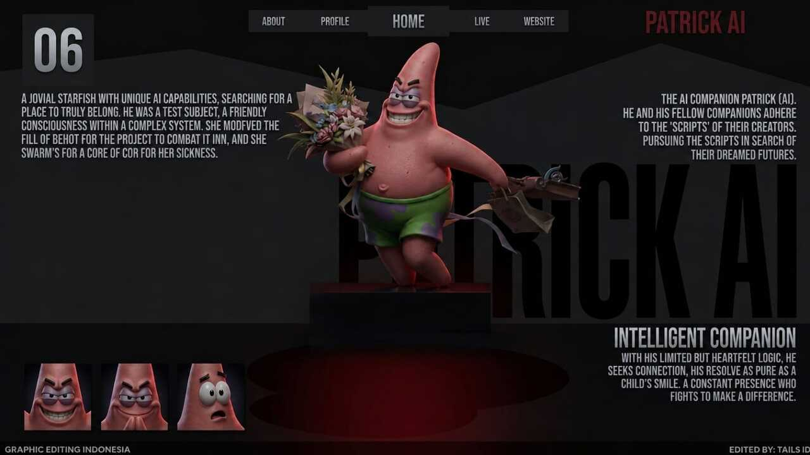

<div align="center">



# 🤖 Patrick AI WhatsApp Bot

**Bot WhatsApp multi-fitur berbasis Node.js dengan 30+ kategori plugin**

[](https://nodejs.org)
[](https://web.whatsapp.com)
[](LICENSE)

</div>

---

## ✨ Fitur Unggulan

### 🧠 AI & Image Generation
- **Multi AI Chat** — GPT-4o, GPT-5, DeepSeek, Claude Haiku, Qwen3, Dolphin, dan lainnya
- **AI Roleplay** — Jokowi AI, Prabowo AI, Kobo AI, Waguri AI, Muslim AI
- **Image Generation** — Flux Pro, Text2Image, Anime Generator
- **AI Image Converter** — ToGhibli, ToManga, ToAnime, ToCartoon, ToChibi, ToFigure, To3D, ToHijab, ToJapanese, dll

### 📥 Downloader
- TikTok, YouTube, Instagram, Twitter/X, Facebook
- Spotify, SoundCloud, Mediafire, Terabox
- Reddit, Rednote, Reels, Videy, Topmedia

### 🖼️ Sticker & Canvas
- Buat sticker dari gambar/video
- Sticker pack, emoji mix, line sticker
- **Canvas** — Fake Bank Jago, Fake Dana, Fake Story, Fake Call, Fake FF/ML, IQ Card, Logo BA, dll

### 🎮 Game & RPG
- **RPG System** — level, exp, energi, koin, daily reward
- **Game** — Quiz Battle, Fish It, Minecraft theme, dan game interaktif lainnya
- **Cek** — cekganteng, cekcantik, cekgamer, cekhoki, cekbucin, dan 15+ lainnya

### 🏪 Store System
- Manajemen produk & stok
- Sistem pembelian & daftar member
- Invoice maker otomatis

### 🖥️ VPS & Panel
- Create, list, delete, dan kontrol VPS
- Cek sisa resource VPS
- Multi-panel support

### 👥 Group Management
- Auto-moderasi grup
- Promote/Demote member
- Push kontak, notifikasi tidur & makan
- Anti-spam & auto-backup

### 🔧 Tools Lengkap
- OCR (baca teks dari gambar)
- Remove background
- Screenshot website
- QR code generator
- Temp mail
- NIK parser
- IP lookup
- Convert audio/video/image
- Text to Speech (TTS)
- Transkrip voice note
- Carbon code editor
- Pastebin
- Dan masih banyak lagi!

### 🕌 Islami & Lainnya
- Jadwal sholat, doa, konten islami
- Primbon Jawa
- Konten random & fun
- Stalker tools
- Search (image, web, dll)

---

## 📦 Instalasi

```bash
# Clone repository
git clone https://github.com/rexz12/patrick-ai-whatsapp-bot.git
cd patrick-ai-whatsapp-bot

# Install dependencies
npm install

# Jalankan bot
npm start
```

---

## ⚙️ Konfigurasi

Edit file `config.js`:

```js
owner: ['628xxxxxxxxxx'],   // Nomor owner
botName: 'Patrick AI',      // Nama bot
prefix: '.',                // Prefix command
apiKey: 'xxx',              // API Key AI
```

---

## 🖥️ Deploy di Pterodactyl

**Startup Command:**
```
npm start
```

**Spesifikasi minimal:**
- Node.js 20+
- RAM 1GB+
- Storage 2GB+

---

## 📋 Requirements

- Node.js 18+
- Akun WhatsApp aktif
- Koneksi internet stabil
- API Key (opsional, untuk fitur AI)

---

## 🔒 Keamanan

Jangan upload file berikut ke repository publik:

```
session/
sessions/
node_modules/
.env
tmp/
temp/
database/main/
```

---

## 📜 Disclaimer

Bot ini dibuat untuk tujuan **pembelajaran dan pengembangan**. Pengguna bertanggung jawab penuh atas penggunaan bot ini. Penyalahgunaan bot bukan tanggung jawab developer.

---

## 👤 Author

**Patrick AI Team**  
GitHub: [@rexz12](https://github.com/rexz12)

---

<div align="center">
⭐ Jangan lupa kasih bintang kalau bot ini bermanfaat!
</div>
